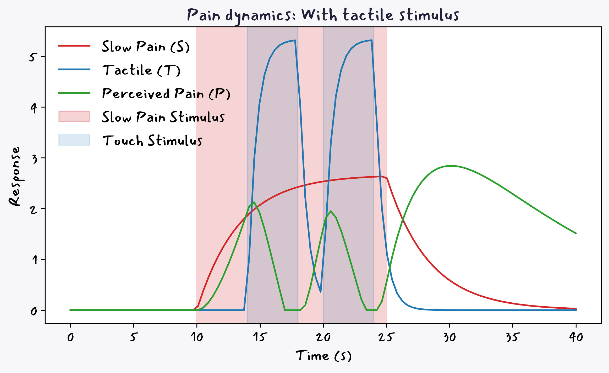

# 🧠 PainGatekeeper: A Computational Model of Pain Modulation 🧘‍♀️

---

## The Pain Gatekeeper👋

Ever wondered why rubbing a painful bump actually makes it feel better? Or how a wounded animal can still flee for its life despite an injury? This repository hosts a fun **computational model** that dives deep into these very questions! We're exploring the fascinating **Gate Control Theory of Pain** using a system of Ordinary Differential Equations (ODEs) to simulate how tactile stimulus can act as your body's personal pain dimmer.

---
## Understanding the Gate Control Theory of Pain 🧠🚪

The **Gate Control Theory of Pain** explains that pain isn't just a straight shot to your brain; there's a dynamic "gate" in your spinal cord that controls how much pain gets through. This gate constantly balances incoming pain signals against other sensory inputs, especially **touch and pressure**.

When non-painful touch signals are sufficiently active, they can effectively "close" this gate, reducing the pain signals that reach your brain. That's why rubbing an injury often makes it feel better! Plus, your brain, with its thoughts and emotions, can also influence this gate, shaping how you experience pain.

## How It Works (The Sciency Bit! 🧪)

At its heart, this model uses three Ordinary Differential Equations (ODEs) to track the dynamic changes in:

1.  **Slow Pain ($S$)**: The persistent, dull ache.
2.  **Touch ($T$)**: The non-painful sensory input.
3.  **Overall Perceived Pain ($P$)**: What you actually feel!

### The Equations:

* $$\frac{dS}{dt} = \alpha_S \cdot Input_S(t) - \beta_S \cdot S(t)$$
    * **$\alpha_S$**: Sensitivity of slow pain to its input.
    * **$\beta_S$**: Natural decay rate of the slow pain signal.
* $$\frac{dT}{dt} = \alpha_T \cdot Input_T(t) - \beta_T \cdot T(t)$$
    * **$\alpha_T$**: Sensitivity of touch to its input.
    * **$\beta_T$**: Natural decay rate of the touch signal.
* $$\frac{dP}{dt} = \alpha_{SP} \cdot S(t) - \alpha_{TP} \cdot \max(0, T(t) - \gamma_T) - \beta_P \cdot P(t)$$
    * **$\alpha_{SP}$**: How much slow pain contributes to perceived pain.
    * **$\alpha_{TP}$**: The strength of touch's inhibitory effect on perceived pain.
    * **$\gamma_T$**: The minimum touch strength needed for it to start inhibiting pain (a threshold!).
    * **$\beta_P$**: Natural decay rate of perceived pain.
## See It In Action! 🎬

This repository includes script to run simulations and visualize the results. You'll be able to observe:
* How perceived pain increases when no touch is present.
* The dramatic decrease in perceived pain when tactile stimulus is applied during specific intervals (e.g., 14-18 minutes and 20-24 minutes).
* The immediate rebound of perceived pain when the touch stimulus is removed.

---
### Simulation Results:
Here's what our model illustrates for perceived pain **without** any tactile intervention:

<!-- *(Image shows perceived pain increasing steadily with a pain stimulus and no touch)* -->
And here's the magic! Observe how perceived pain is dramatically reduced when **tactile stimulus is applied** during the pain:

<!-- *(Image shows perceived pain decreasing during intervals of tactile stimulus and rebounding when touch is removed)* -->
--
**Have fun exploring the fascinating world of pain and touch!** 🥳